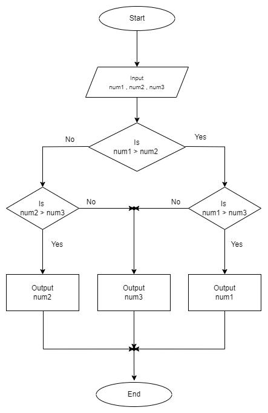

# Algorithm to compare three number;

1. Start
2. Input num1 ,num2 ,num3
3. Process

   if num1 > num2 & num1 > num3

   then output = num1

   else if num2 > num3

   then output = num2

   else output = num3

4. Output output
5. End

# Flowchart to compare three number

