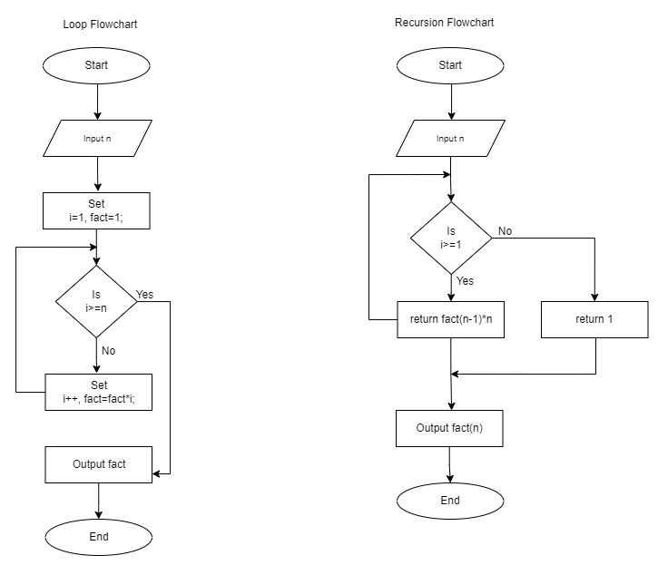

# Factorial

## Factorial Using Loop

```
1. Start
2. Input n
3. Set i=1,fact=1
4. if i>=n
   result = fact;
5. else
   set i=i+1
   go to step 3
6. Output result
7. End
```

## Factorial using Recursive function

```
1. Start
2. Input n
3. if i>=1
   return 1;
4. else
   return fact(n-1) \* n
5. result = fact(n)
6. Output result
7. End
```

# Factorial Flowchart


